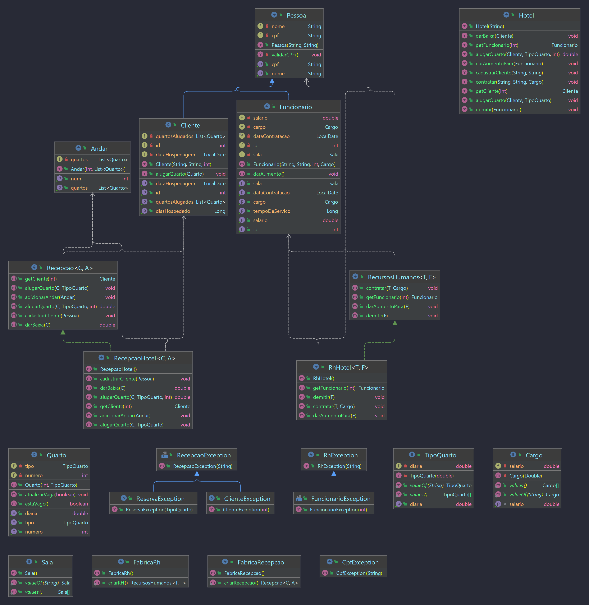

# imd0040-tfinal

Repositório modelo para criação do Projeto Final da disciplina de Linguagem de Programação II do Instituto Metrópole Digital da UFRN ministrada pelo Prof. Gustavo Leitão.

As instruções detalhadas para o trabalho podem ser encontradas [neste link](https://happy-wool-a9a.notion.site/Trabalho-III-Unidade-a839a62426ea4c5a9d03df8144703aab).

## Link para vídeo de apresentação

https://www.youtube.com/watch?v=UjyDG51rYAE

## Descrição do trabalho

Este trabalho consiste em uma modelagem de um sistema de logística para hotéis, visando facilitar a adminstração das reservas e dos funcionários. Nele, é possível:

- cadastrar clientes: armazenando os quartos que ele alugou e calculando o preço da estadia automaticamente;
- gerenciar funcionários: lidando com os diferentes cargos e com as mudanças de salário;
- gerenciar quartos e andares: adicionando novos ao hotel quando necessário e separando os quartos por tipo.

Ademais, o sistema é feito para que seja possível se adaptar a diferentes modelos de administração, dessa forma, pode-se utilizar em diferentes hotéis.

Autores:
- André Freitas Silveira (freitasandre38@gmail.com) <a href="https://github.com/andrefsilveira1">@andrefsilveira1</a>
- João Guilherme Lopes Alves da Costa (joguicosta@hotmail.com) <a href="https://github.com/joaoguilac">@joaoguilac</a>
- José Davi Viana Francelino (jose.davi@imd.ufrn.br) <a href="https://github.com/davi-i">@davi-i</a>

## Diagrama de classes



## Instruções para build e execução

Para compilar o projeto, é necessário primeiramente clonar o repositório na sua máquina:

```zsh
$ git clone git@github.com:imetropoledigital/imd0040-trabalho-final-andre_davi_joao.git
$ cd imd0040-trabalho-final-andre_davi_joao
```

Agora, se quiser apenas compilar o projeto:

```zsh
$ ./gradlew build
```

Se quiser rodar os testes desenvolvidos para o projeto:
```zsh
$ ./gradlew test -info
```

